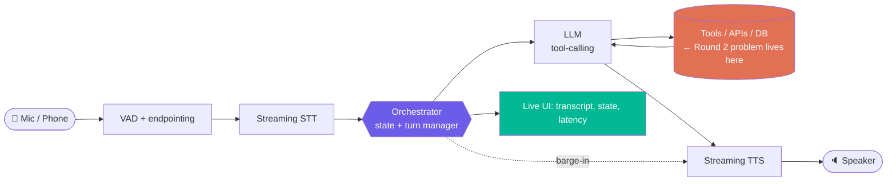
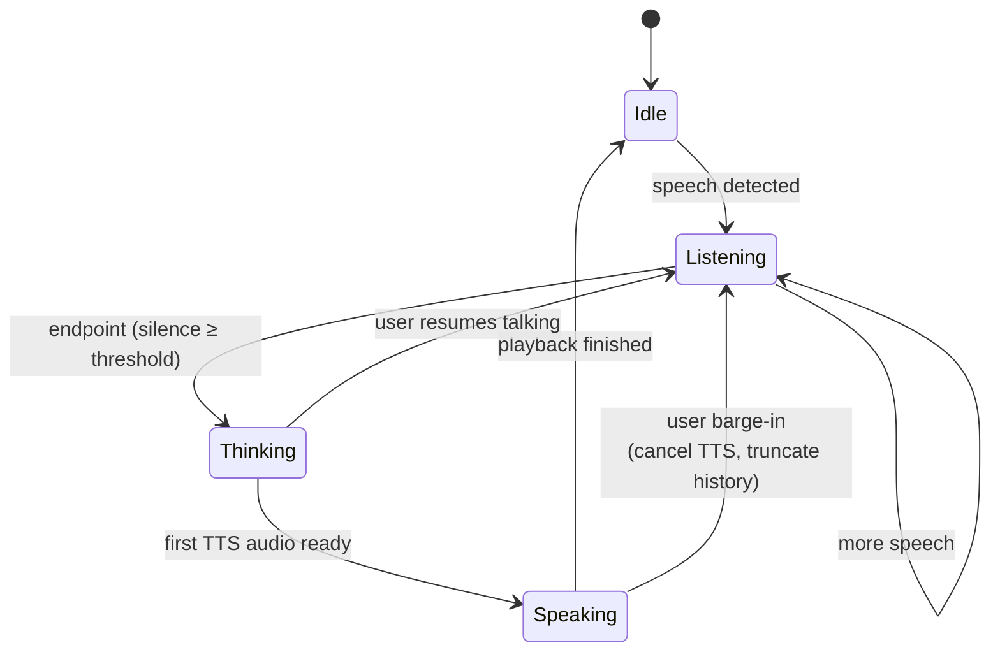
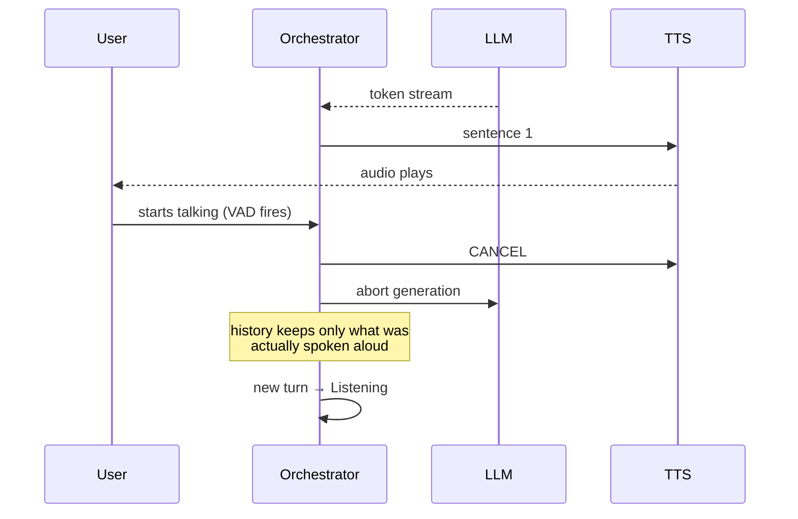

<div align="center">

# 🎙️ rvhack — Voice AI Track

**Round 1: CodeChef assessment → Round 2: build-on-the-spot challenge**


*A playbook, a pre-built skeleton, and a demo strategy. Not a pitch deck in Markdown.*

[Rules](#-what-we-know) · [Round 1](#-round-1--codechef-prep) · [Architecture](#-the-architecture-we-pre-build) · [Build day](#-round-2--build-day-timeline) · [Winning](#-how-we-win) · [Demo](#-the-demo-script) · [Checklist](#-pre-event-checklist)

</div>

---

## 📌 What we know

| | |
|---|---|
| **Track** | Voice AI |
| **Round 1** | Online, track-specific, on **CodeChef**. Covers speech recognition, TTS, voice processing, conversational AI. Performance decides who reaches Round 2. |
| **Round 2** | Problem statement is revealed **on the day**. We build from scratch against it. |
| **Allowed** | Any voice/AI API: STT, TTS, LLMs, real-time comms platforms. |
| **Unknown** | The problem statement, judging rubric weights, time limit, team size limits. *Confirm with organisers.* |

> **The core insight:** we can't know the problem, but we *can* know the plumbing. Every voice problem statement needs the same loop: **hear → understand → act → speak**. Teams that spend Round 2 wiring up audio I/O lose to teams that arrive with that solved and spend the whole time on the *problem*.

---

## 🧠 Round 1 — CodeChef prep

Click a topic to expand what we need to be able to answer cold.

<details>
<summary><b>🔊 Speech recognition (ASR / STT)</b></summary>

- Pipeline: audio → framing → features (log-mel / MFCC) → acoustic model → decoder (+ language model) → text
- **WER** = (Substitutions + Deletions + Insertions) / Reference words. Be able to compute it by hand and in code (edit distance).
- Streaming vs batch: interim vs final results, chunk size, latency/accuracy tradeoff
- CTC vs attention encoder-decoder vs transducer (RNN-T); why Whisper is 30 s-window seq2seq and not natively streaming
- Endpointing: how the system decides you've finished talking
- Failure modes: accents, noise, code-switching, domain vocabulary, homophones → fixes: keyword boosting, custom vocab, LM rescoring

</details>

<details>
<summary><b>🗣️ Text-to-speech (TTS)</b></summary>

- Classic: text normalisation → grapheme-to-phoneme → prosody → vocoder
- Neural: acoustic model (Tacotron / FastSpeech / VITS-style) + vocoder (HiFi-GAN etc.); modern LLM-style codec models
- Text normalisation matters: "₹1,250", "Dr.", "3/4", dates, phone numbers
- **TTFB** (time to first audio byte) is the metric that matters for conversation, not total synthesis time
- SSML: `<break>`, `<prosody>`, `<say-as>`; streaming synthesis sentence-by-sentence
- MOS as the subjective quality score

</details>

<details>
<summary><b>🎚️ Voice / audio processing (the DSP that shows up in tasks)</b></summary>

- Sampling rate, Nyquist, bit depth. 8 kHz telephony vs 16 kHz ASR vs 24/44.1 kHz TTS output. **Resampling bugs are the #1 silent killer.**
- PCM16 vs float32, mono vs stereo, little-endian byte handling
- FFT, STFT, spectrogram, mel scale, windowing (Hann), hop length
- **VAD** (voice activity detection): energy threshold vs model-based (Silero, WebRTC VAD)
- Noise suppression, **AEC** (acoustic echo cancellation) — why the bot hears itself without it
- Diarization: who spoke when
- Codecs: Opus, μ-law/A-law (telephony), WAV/FLAC

</details>

<details>
<summary><b>💬 Conversational AI</b></summary>

- Intent + slot filling vs LLM tool-calling
- Dialogue state tracking, context window management
- **Turn-taking & barge-in**: user interrupts → stop TTS *and* discard the unspoken part of the assistant's turn from history
- Latency budget (see [below](#-latency-budget))
- Grounding / hallucination control: RAG, tool use, constrained output
- Fallbacks: "I didn't catch that", confirmation for destructive actions

</details>

<details>
<summary><b>⌨️ Likely coding-task shapes</b></summary>

- Implement WER / CER (Levenshtein DP)
- Chunk a PCM stream into fixed frames with overlap; energy-based VAD
- Parse/normalise numbers and dates out of a transcript
- Simulate a dialogue state machine
- Merge/segment timestamps (word-level → sentence-level; diarization merge)
- Sliding-window / two-pointer problems on audio-like arrays

Practise these as plain algorithm problems. CodeChef assessments reward correct + fast, not clever.

</details>

**Round 1 tracker** — tick these off as we go:

- [ ] Implement WER from scratch (Levenshtein, O(nm))
- [ ] Implement frame-based VAD on a raw PCM array
- [ ] Re-derive mel filterbank steps on paper
- [ ] Explain barge-in handling end to end without notes
- [ ] Do 10 medium DP / string problems on CodeChef under a timer
- [ ] Everyone has a working CodeChef account and has done a practice contest

---

## 🏗️ The architecture we pre-build

We arrive with this **already working**. In Round 2 we only swap the *brain* and the *tools*.



The orange box is the *only* part that changes per problem statement. Everything else is reusable.

### Turn-taking state machine



### Barge-in, the part most teams get wrong



If the assistant "remembers" saying a sentence the user never heard, the conversation goes off the rails. Truncate history to what was actually played.

### ⏱️ Latency budget

Target **< 1 s from end of user speech to first audio out.** Below ~700 ms it feels like a person.

| Stage | Target | How |
|---|---|---|
| Endpointing | 200–400 ms | tuned VAD silence window, not a fixed 1 s |
| STT final | 100–300 ms | streaming ASR, use interim results to prefetch |
| LLM first token | 250–500 ms | small/fast model, short prompt, prompt caching |
| TTS first byte | 100–300 ms | streaming TTS, **start on first sentence** |
| **Total** | **< 1 s** | overlap the stages, never run them in series |

We display this live on screen during the demo. Measured numbers beat claims.

### Stack decision (pick once, in advance)

| Layer | Primary | Fallback | Why |
|---|---|---|---|
| Transport | **LiveKit** or **Pipecat** | plain WebSocket + browser `AudioWorklet` | handles WebRTC, jitter, echo; saves hours |
| VAD | Silero VAD | WebRTC VAD | runs locally, no network hop |
| STT | Deepgram streaming | Whisper (local/API) | low-latency streaming with interim results |
| LLM | fast tool-calling model | second provider | keep two keys ready, hackathon wifi lies |
| TTS | ElevenLabs / Cartesia streaming | OS-native TTS | Cartesia/ElevenLabs for quality, OS-native so demo never dies |
| UI | Next.js or plain Vite page | — | live transcript + state + latency chart |

> ⚠️ Don't pick by hype. Pick the stack we've **already tested together**, then stick with it. A fallback for every layer is mandatory: venue wifi and API rate limits will hit at the worst time.

---

## ⏳ Round 2 — build day timeline

```mermaid
gantt
    title Round 2 (example: 8h build — scale proportionally)
    dateFormat  HH:mm
    axisFormat  %H:%M
    section Understand
    Read problem, pick ONE user, write success metric :a1, 09:00, 30m
    section Adapt
    Swap tools/prompt into skeleton, first e2e voice loop :a2, 09:30, 90m
    section Depth
    Failure handling, edge cases, the "wow" feature :a3, 11:00, 150m
    section Polish
    UI, latency panel, fallback modes :a4, 13:30, 90m
    Freeze code :milestone, 15:00, 0m
    section Ship
    Rehearse demo x3, record backup video, write submission :a5, 15:00, 60m
```



**Hard rules**
1. **Working end-to-end voice loop within the first 2 hours**, however ugly. Improve a running system; never assemble a big-bang one.
2. **Code freeze 1 hour before deadline.** Last-hour features break demos.
3. **Record a backup demo video** before the live one. Wifi will die.
4. One person owns the demo and never touches code in the last hour.

### Roles

| Role | Owns | Name |
|---|---|---|
| 🎧 Audio/Realtime | mic → STT → TTS → speaker, VAD, barge-in, latency | _TBD_ |
| 🧠 Brain/Tools | prompt, tool schemas, problem logic, evals | _TBD_ |
| 🎨 Frontend/Demo | UI, live transcript, visual state, demo script | _TBD_ |
| 🧪 QA/Story | breaks the system, writes test utterances, pitch, submission | _TBD_ |

---

## 🏆 How we win

Judges see 20+ voice bots. Most are the same thing: *"talk to an LLM, it talks back."* That's the baseline, not the differentiator. Where the points actually are:

<details open>
<summary><b>1. Solve the stated problem, for a specific person</b></summary>

Generic "AI assistant" loses to "a night-shift pharmacist with gloved hands who needs to check drug interactions without touching a screen." Name the user, name the moment voice is genuinely *better than a screen*, and say it in the first 20 seconds.

**Test:** if the same product would work as a text chatbot, voice isn't earning its place. Find the reason it must be voice: hands busy, eyes busy, low literacy, phone-only access, accessibility, regional language.

</details>

<details>
<summary><b>2. Feel real-time: latency and interruption</b></summary>

- Sub-second response, visibly measured
- Barge-in works live on stage (interrupt it on purpose in the demo)
- Filler/acknowledgement while a slow tool runs ("checking that now…") instead of dead air

</details>

<details>
<summary><b>3. Do something, not just say something</b></summary>

Voice that triggers real tool calls (book, look up, update a record, call an API) beats voice that answers from vibes. Show the side-effect on screen: the row that changed, the booking that appeared.

</details>

<details>
<summary><b>4. Handle the ugly cases on purpose</b></summary>

Show one deliberately hard moment live:
- user mumbles / changes their mind mid-sentence
- ASR mishears a name → system asks to confirm instead of acting
- low-confidence transcript → clarifying question
- destructive action → explicit spoken confirmation
- Hindi/English code-switching if the problem is India-facing

Judges remember the moment the system *recovered gracefully*, not the happy path.

</details>

<details>
<summary><b>5. Prove it works: small eval, real numbers</b></summary>

Even 20 scripted utterances with a pass/fail table beats "it works great." Put one slide/screen: task success rate, median latency, WER on our test set. Honest numbers, including where it fails.

</details>

<details>
<summary><b>6. Not "AI slop": the anti-checklist</b></summary>

Things that make a project read as generated filler. Avoid all of them:

- ❌ A UI that is a chat window with a mic button and nothing else
- ❌ Claims with no measurement ("blazing fast", "human-like")
- ❌ Features that exist only in the README
- ❌ Generic system prompt: "You are a helpful assistant"
- ❌ Tech-name soup on the slide with no reason each piece was chosen
- ❌ A demo that only works with the exact scripted sentence
- ✅ One sharp problem, one real user, a working loop, a measured result, an honest limitations slide

</details>

### Scoring self-check (we grade ourselves before submitting)

| Criterion | Question we must answer "yes" to | ✅ |
|---|---|---|
| Problem fit | Does it directly solve the given statement, not a nearby one? | ☐ |
| Voice-necessity | Is voice clearly better than text here? | ☐ |
| Technical depth | Streaming, barge-in, tool-calls, or fallbacks, visibly? | ☐ |
| Robustness | Survives a judge saying something unexpected? | ☐ |
| Demo | Works live, has a backup, under 3 minutes? | ☐ |
| Honesty | Do we state limitations and real metrics? | ☐ |

---

## 🎬 The demo script

Three minutes. Rehearsed until boring.

| Time | Beat |
|---|---|
| 0:00–0:20 | **The person + the pain.** One sentence, no tech names. |
| 0:20–1:20 | **Happy path, live.** Real voice, real tool action visible on screen. |
| 1:20–2:00 | **The break.** Interrupt it mid-sentence. Mumble a name. Show it recover. |
| 2:00–2:30 | **The numbers.** Latency panel, eval table. |
| 2:30–3:00 | **Limits + what's next.** What it can't do yet, honestly. |

Backup plan, in order: live mic → pre-recorded audio file fed through the same pipeline → recorded video.

---

## ✅ Pre-event checklist

Everything here is done **before** Round 2, so build day is only the problem.

**Accounts & keys** (two providers per layer)
- [ ] STT key + fallback
- [ ] LLM key + fallback
- [ ] TTS key + fallback
- [ ] Keys in `.env`, `.env.example` committed, `.env` gitignored
- [ ] Confirm free-tier rate limits won't cut us off mid-demo

**Skeleton repo** (`/skeleton`, to be built)
- [ ] Browser mic → streaming STT → LLM → streaming TTS → speaker, working
- [ ] Barge-in implemented and tested
- [ ] Tool-calling scaffold: add a tool in one file, one schema
- [ ] Live UI: transcript, state (listening/thinking/speaking), per-stage latency
- [ ] Text-input fallback mode + pre-recorded audio replay mode
- [ ] Runs on a fresh laptop with `one command`

**Logistics**
- [ ] Headset mics + a wired speaker for the demo (laptop speakers cause echo)
- [ ] Phone hotspot as backup network
- [ ] Charger, extension cord
- [ ] Everyone has Git configured and can push

---

## 🗂️ Repo layout (planned)

```
rvhack/
├── README.md            ← this file
├── skeleton/            ← reusable voice loop (audio, VAD, STT, TTS, orchestrator)
│   ├── audio/
│   ├── orchestrator/
│   ├── tools/           ← the only folder that changes per problem
│   └── ui/
├── evals/               ← scripted utterances + pass/fail runner
├── prep/                ← Round 1 practice solutions (WER, VAD, DP)
└── demo/                ← script, backup video, slides
```

---

## 🔗 Useful references

- [LiveKit Agents](https://docs.livekit.io/agents/) · [Pipecat](https://github.com/pipecat-ai/pipecat) — realtime voice pipelines
- [Silero VAD](https://github.com/snakers4/silero-vad) — local voice activity detection
- [Deepgram docs](https://developers.deepgram.com/) · [OpenAI Whisper](https://github.com/openai/whisper) — STT
- [ElevenLabs docs](https://elevenlabs.io/docs) · [Cartesia docs](https://docs.cartesia.ai/) — TTS
- [CodeChef](https://www.codechef.com/) — Round 1 platform

---

<div align="center">

**Ship a small thing that works, measured honestly, over a big thing that almost works.**

</div>
